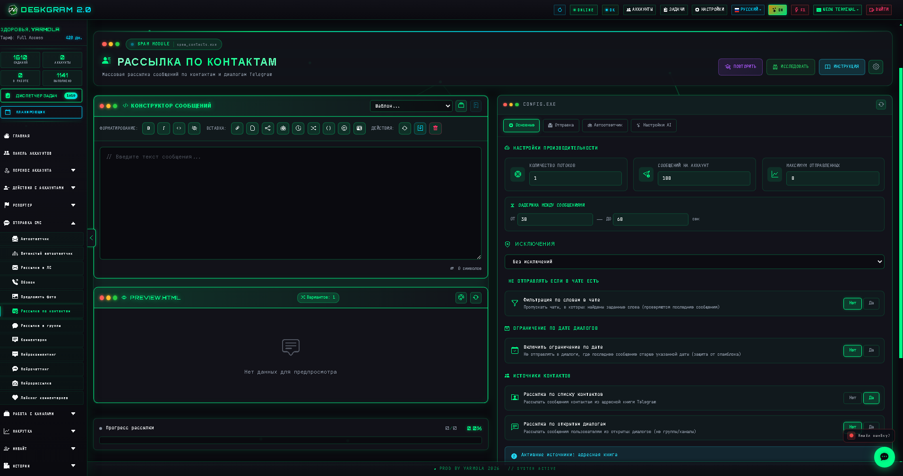
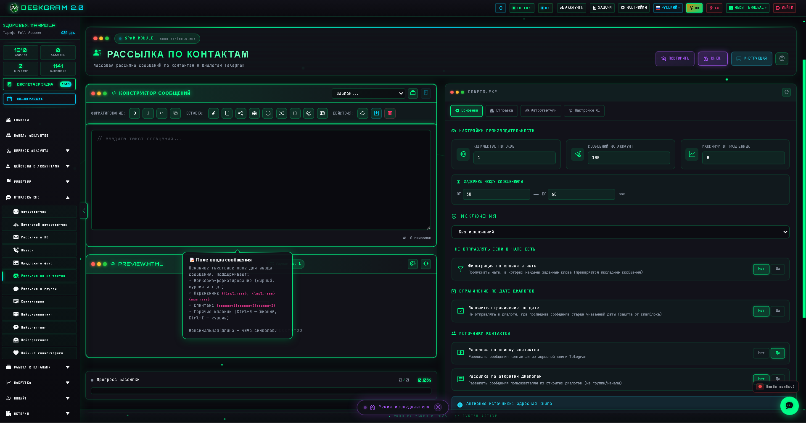
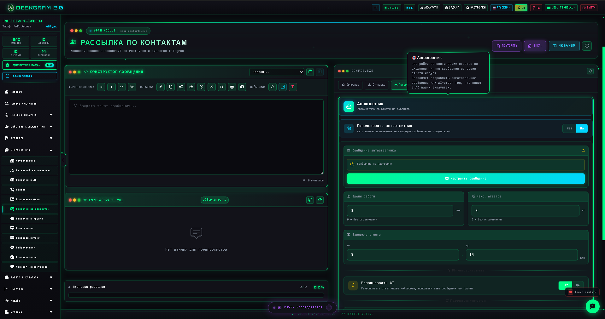
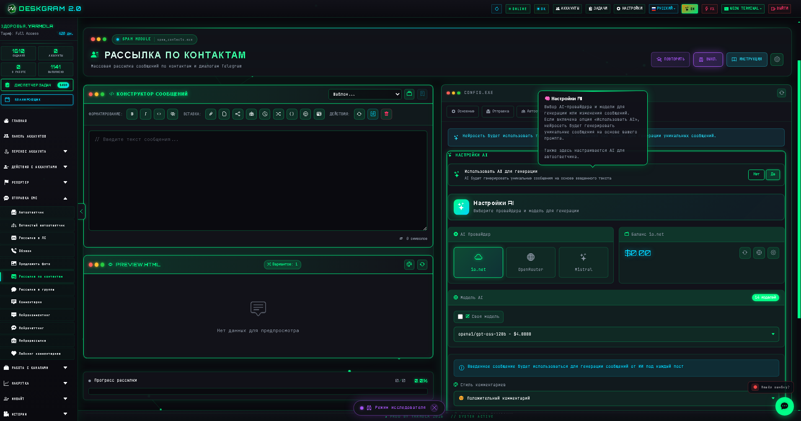

# Массовые сообщения по контактам в Telegram через Deskgram 2

Модуль сообщений по контактам в Deskgram 2 помогает выстраивать отдельный канал коммуникации через список контактов, контролировать производительность, задержки, вкладки отправки, автоответы и AI-настройки. Это полезно, когда рабочий маршрут строится вокруг базы контактов, а не вокруг чатов, каналов или случайных username-списков.

[Главный хаб Deskgram 2](https://github.com/Deskgram-2/deskgram-2-telegram-automation) · [Сайт](https://deskgram2.com/) · [Telegram-бот](https://t.me/DG2welcomebot) · [Web preview](https://deskgram2.com/web-preview?path=%2Fapp-demo%2F&lang=ru)

## Интерактивный Web Preview

Попробовать модуль в браузере: [Открыть веб-превью](https://deskgram2.com/web-preview?path=%2Fapp-demo%2Ffunctions%2Fspam_contacts&lang=ru)

Так можно заранее посмотреть конструктор сообщений, прогресс, лог-панель и вкладки настроек до запуска на реальной базе контактов.

## Скриншоты

## Кратко о модуле

| Параметр | Что внутри |
|---|---|
| Основная задача | Массовая отправка сообщений по контактам в Telegram |
| Важные блоки | Конструктор сообщений, прогресс, лог-панель, вкладки main/send/auto-machine/AI |
| Полезен для | Контактных баз, повторных касаний, отдельных CRM-подобных маршрутов внутри Telegram |
| Связанные модули | Рассылка в ЛС, Панель аккаунтов, Прокси, Настройки |

## Что умеет модуль

- отправлять сообщения по базе контактов;
- контролировать производительность и лимиты на аккаунт;
- работать с задержками и вкладками отправки;
- подключать автоответы и AI-опции в том же маршруте;
- держать прогресс и логи в одной панели.

## Быстрый старт

1. Подготовьте текст сообщения.
2. Загрузите или выберите контактную базу.
3. Настройте производительность, лимиты и задержки.
4. При необходимости включите автоответчик и AI-вкладку.
5. Запустите модуль и отслеживайте прогресс через лог-панель.

## Где этот модуль особенно полезен

- [Рассылка в ЛС](https://github.com/Deskgram-2/telegram-direct-messaging-deskgram), если часть маршрутов идет через username/диалоги, а часть через контакты;
- [Панель аккаунтов](https://github.com/Deskgram-2/telegram-account-manager-deskgram), если сначала нужно выстроить сетку аккаунтов под контактные касания;
- [Прокси](https://github.com/Deskgram-2/telegram-proxy-manager-deskgram), если стабильность контактного маршрута зависит от инфраструктуры;
- [Настройки автоматизации](https://github.com/Deskgram-2/telegram-automation-settings-deskgram), если контактные сценарии должны опираться на общие системные и AI-настройки.

## Что выбрать: сообщения по контактам или рассылку в ЛС

| Если задача такая | Лучше использовать |
|---|---|
| Работа идет вокруг контактной базы | `Сообщения по контактам` |
| Нужна более универсальная линия диалогов и username-маршрутов | [Рассылка в ЛС](https://github.com/Deskgram-2/telegram-direct-messaging-deskgram) |
| Важен отдельный CRM-подобный слой внутри Telegram | `Сообщения по контактам` |
| Нужен общий outreach-модуль без привязки к контактной базе | `Рассылка в ЛС` |

## Смежные репозитории

- [Главный хаб Deskgram 2](https://github.com/Deskgram-2/deskgram-2-telegram-automation)
- [Рассылка в ЛС](https://github.com/Deskgram-2/telegram-direct-messaging-deskgram)
- [Панель аккаунтов](https://github.com/Deskgram-2/telegram-account-manager-deskgram)
- [Прокси](https://github.com/Deskgram-2/telegram-proxy-manager-deskgram)
- [Настройки автоматизации](https://github.com/Deskgram-2/telegram-automation-settings-deskgram)

## FAQ

### Можно ли сначала посмотреть модуль в браузере?

Да. Веб-превью уже показывает конструктор сообщений, прогресс, лог-панель и ключевые вкладки настроек.

### Это то же самое, что и обычная рассылка в ЛС?

Не совсем. Здесь акцент именно на маршрутах по базе контактов и связанным с ней сценариям.
